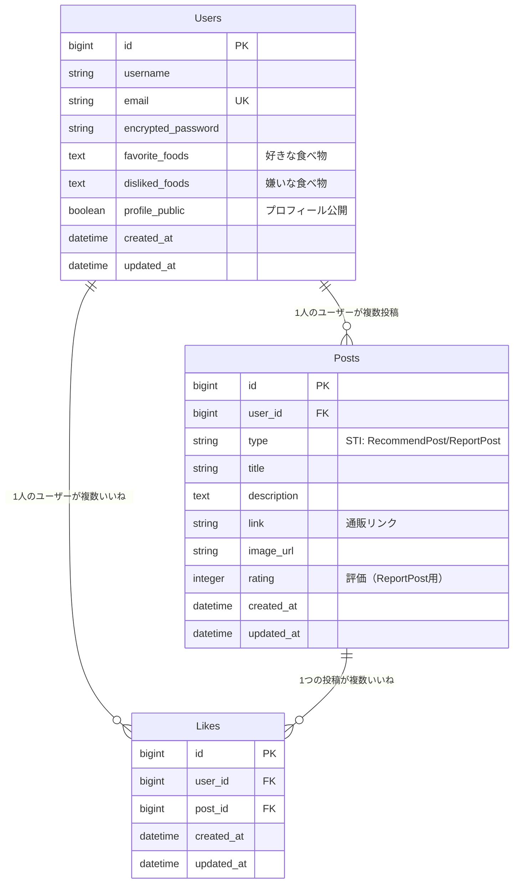

# アーキテクチャ設計書

## 使用技術スタック

### バックエンド
- **フレームワーク**: Ruby on Rails 7.2
- **言語**: Ruby 3.3.6
- **データベース**: PostgreSQL 17.6
- **認証**: Devise（予定）
- **テンプレートエンジン**: Haml (Hamlit)

### フロントエンド
- **CSS**: TailwindCSS v4
- **JavaScript**: Hotwire (Turbo + Stimulus)
- **レスポンシブ**: モバイルファースト設計

### 開発・テスト環境
- **テストフレームワーク**: RSpec + FactoryBot + Faker
- **コード品質**: Rubocop + Brakeman
- **開発支援**: Better Errors + Ruby LSP
- **コンテナ**: Docker + Docker Compose

### インフラ（予定）
- **デプロイ**: Render
- **画像ストレージ**: S3等クラウドストレージ
- **CI/CD**: GitHub Actions

## ディレクトリ構造

```
gohan-otomo/
├── app/
│   ├── controllers/         # コントローラー（REST API）
│   ├── models/             # モデル（ビジネスロジック）
│   ├── views/              # ビュー（Hamlテンプレート）
│   ├── javascript/         # Stimulus コントローラー
│   └── assets/
│       └── stylesheets/    # TailwindCSS設定
├── spec/                   # RSpecテスト
│   ├── models/
│   ├── controllers/
│   ├── features/          # E2Eテスト
│   └── support/           # テスト設定
├── config/                # Rails設定
├── db/                    # データベース関連
├── docs/                  # プロジェクトドキュメント
└── .github/workflows/     # GitHub Actions CI
```

## レイヤー構造

### MVCアーキテクチャ
```
View Layer (Haml + Stimulus)
    ↓
Controller Layer (Rails Controllers)
    ↓
Model Layer (ActiveRecord + ビジネスロジック)
    ↓
Database Layer (PostgreSQL)
```

### 責任分離
- **Controller**: HTTPリクエスト処理、レスポンス生成
- **Model**: ビジネスロジック、データ整合性
- **View**: UI表示、ユーザーインタラクション
- **Service Objects**: 複雑なビジネスロジック（今後追加予定）

## データベース設計（ER図）

### 現在の設計（初期案）



### STI（Single Table Inheritance）設計

```ruby
# 基底クラス
class Post < ApplicationRecord
  belongs_to :user
  has_many :likes
end

# おすすめ投稿
class RecommendPost < Post
  # title, description, link, image_url
end

# 食べてみた投稿
class ReportPost < Post
  # title, description, image_url, rating
end
```

## セキュリティ設計

### 認証・認可
- **認証**: Devise（セッションベース）
- **認可**: CanCanCan（今後追加予定）
- **CSRF**: Rails標準機能
- **XSS**: Rails標準エスケープ

### セキュリティチェック
- **静的解析**: Brakeman（CI実行）
- **依存関係**: Bundler audit（今後追加予定）

## パフォーマンス設計

### 画像処理
- **アップロード**: Active Storage
- **最適化**: image_processing gem
- **外部画像取得**: OGP、Amazon/楽天API

### キャッシュ戦略（今後実装予定）
- **フラグメントキャッシュ**: 投稿一覧
- **画像キャッシュ**: CDN利用

## 今後の拡張予定

### アーキテクチャ改善
- Service Object パターンの導入
- Background Job（Sidekiq等）の導入
- API化（REST API）
- フロントエンド分離（今後検討）

### 技術的負債対策
- N+1クエリ対策
- データベースインデックス最適化
- セキュリティ強化
